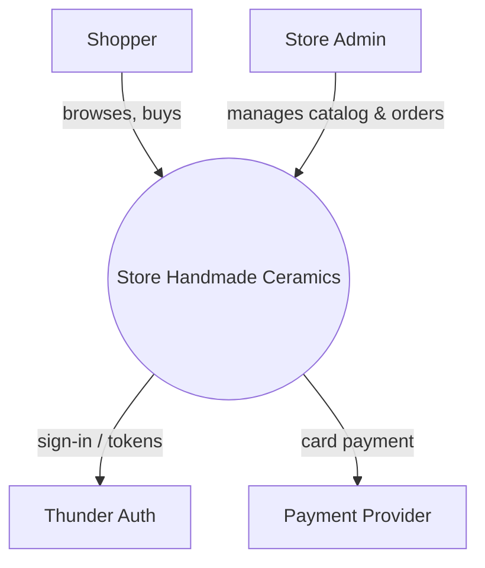
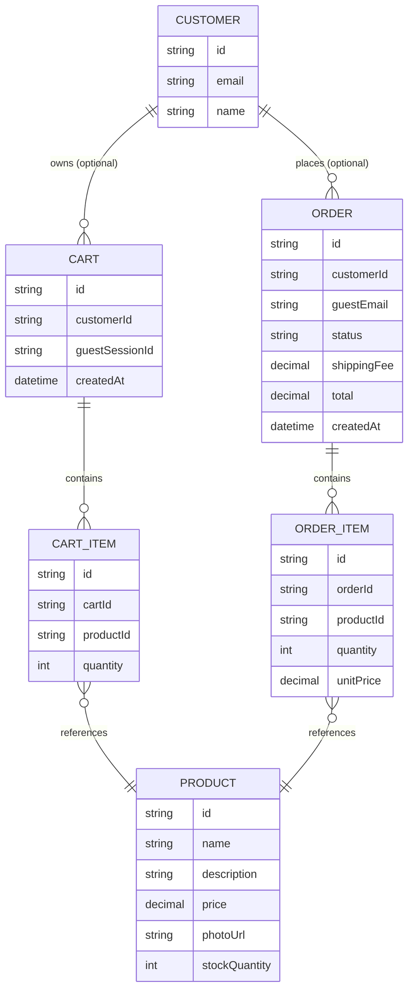
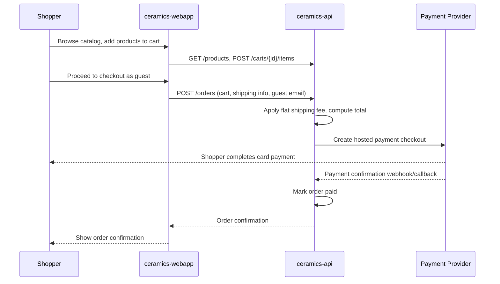
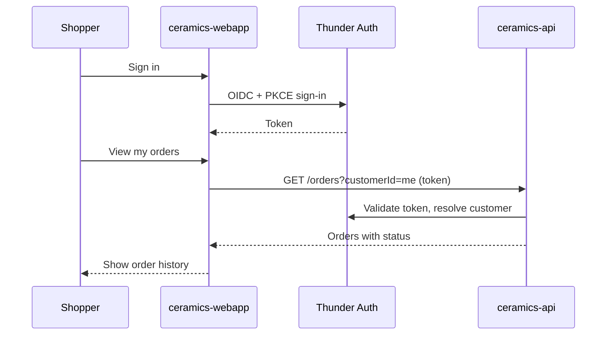
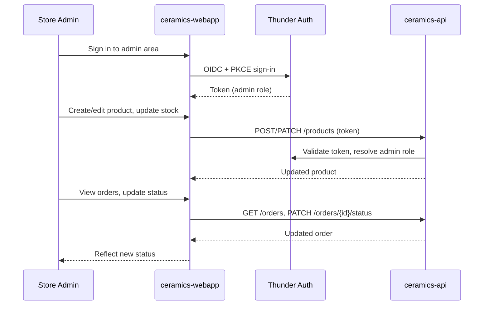

# Store Handmade Ceramics — Design

## Overview

A single-seller online store for handmade ceramics. Shoppers use the
`ceramics-webapp` single-page app to browse the product catalog, manage a
cart, and check out — as a guest or signed in via Thunder — paying by card
through a hosted third-party payment checkout, with a flat shipping fee added
at checkout. The same webapp exposes a role-gated admin area where the Store
Admin manages products, tracks inventory, and updates order status. All
business logic and persistence live in the `ceramics-api` service, backed by
`ceramics-db`; the webapp holds no secrets and never talks to the database or
payment provider directly.

## Context (C1)

## Domain model (ER)

## Key flows

### Guest checkout

### Signed-in shopper order history

### Admin manages catalog, inventory, and order status

